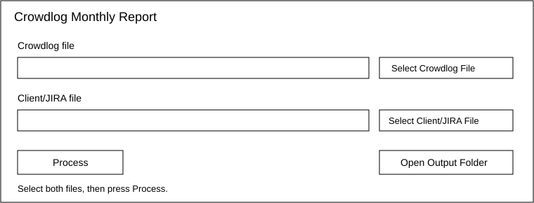

# Crowdlog Monthly Reporting

## HOW TO USE

1. Double-click `run.bat` on Windows. On macOS/Linux, run `./run.sh`.
2. Press **Select Crowdlog File** and choose your Crowdlog export.
3. Press **Select Client/JIRA File** and choose your Client/JIRA reference file.
4. Press **Process**.
5. When processing finishes, press **Open Output Folder**.
6. Open the generated monthly report and check the **Review Needed** sheet.

### One-time installation

Install Python 3.11 or newer, then open a command prompt in this folder and run:

```bash
pip install -r requirements.txt
```

The program is completely local. The simple desktop window has no database, cloud connection,
Jira API, AI service, or API key.

## Running the report with the simple window

The window is intentionally simple and runs only on your computer. It does not upload your files
to the internet. Select the two files, press **Process**, and wait for the success message. You do
not need to rename or move the files first.



## Advanced command-line use

If you prefer not to use the window, put both files in `input` and run:

```bash
python main.py
```

To provide files in another location:

```bash
python main.py --crowdlog path/to/crowdlog.xlsx --client path/to/client.xlsx
```

To create only one month when an export contains several months:

```bash
python main.py --month 2026-07
```

Both `.xlsx` and `.csv` inputs are supported. Each month produces a new file named
`YYYY-MM_monthly_report.xlsx`. Existing output is never overwritten; a suffix such as `_2`
is added instead.

## What the workbook contains

* **Monthly Report** contains safely matched and aggregated Employee + Jira Ticket + Month work.
* **Review Needed** explains missing tickets, unknown categories, conflicts, invalid values, and
  other records that need a person to check them. A problem in one row does not stop valid work.

Minutes are summed before conversion to hours. Logged task and billing values are retained;
suggestions come from the Client/JIRA task. Intentional Non-Billable work never receives a
billable suggestion.

Business rules, the `GDX` organization value, and employee aliases are in
`config/settings.json` so they can be maintained without changing Python code.

## Troubleshooting

* Keep exactly one Crowdlog file and one Client/JIRA file in `input` for automatic detection.
* Close input/output workbooks in Excel before running the program.
* Read the plain-language console message if file columns cannot be identified.
* Always inspect **Review Needed** before using a report.

## Tests

```bash
python -m pytest
```
